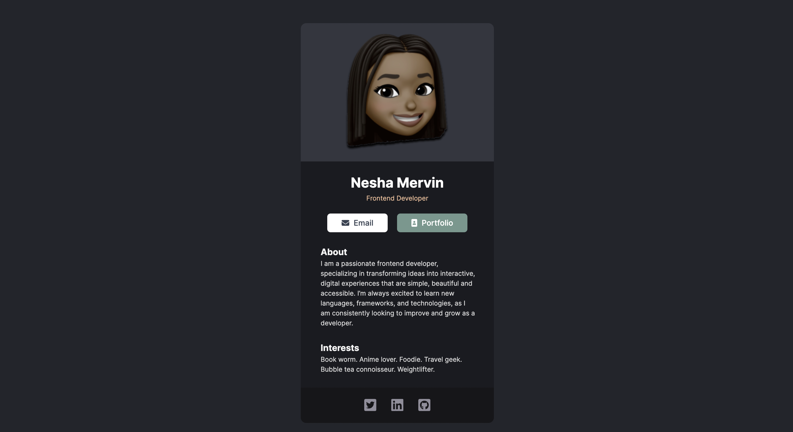

# digital-business-card

## Built with
- Vite + React
- CSS Flexbox

## Lessons Learned
This was my very first React project that I built using Vite + React. The design spec is from Scrimba, which I followed from Figma. I learned how to create components, how to import images and import FontAwesome icons.

## Future Updates
- Set up toggle button to switch colour theme between light and dark
